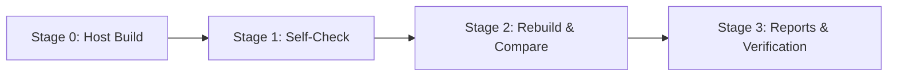

# Flake Bootstrap Architecture & Policy

This document defines the bootstrap model, verification loop, and operational policies for **Flake v0.14.0 (Phase 5 of 6 toward v1.0)**.

---

## 1. What Bootstrap Means in Flake

In Flake v0.14, "bootstrap" is defined as a closed, automated verification loop where the self-hosted frontend and type/effect/ownership checker (`selfhost/frontend/`) is compiled natively, verifies its own sources and test suite, rebuilds cleanly, and confirms behavioral and bitwise identity.

The bootstrap process consists of four automated stages:



### Stage 0: Host Compilation
The pure Rust host compiler (`flake build`) compiles `selfhost/frontend/main.flk` into a standalone native binary (`target/bootstrap/stage0/flake-check-selfhost.exe` on Windows, or ELF executable on Linux).

### Stage 1: Mandatory Self-Check
The newly minted Stage 0 binary executes independently (without invoking Rust or the Flake VM) to verify:
1. **Selfhost Walk (`--walk selfhost`)**: Recursively scans and parses all 11 files of the self-hosted compiler frontend.
2. **Examples Walk (`--walk examples`)**: Scans and parses all 62 example programs in the repository.
3. **Golden Accept Corpus (16 files)**: Type-checks and verifies all golden accept examples (`hello.flk`, `enum.flk`, `traits.flk`, `effects.flk`, `ownership.flk`, `borrow.flk`, `modules.flk`, `v09_flk_scan/main.flk`, `visible.flk`, `nursery.flk`, `concurrency.flk`, `math.flk`, `lists.flk`, `fizzbuzz.flk`, `fibonacci.flk`, `const_fold.flk`).
4. **Golden Reject Corpus (9 cases)**: Verifies that illegal effect usage, use-after-move, escaping references, thread-unsafe borrows, type errors, unknown symbols, unsatisfied bounds, compile-time I/O in const, and impure const fn calls are rejected with diagnostic error spans.

### Stage 2: Rebuild & Comparison
The host compiler rebuilds the self-hosted frontend a second time into an isolated path (`target/bootstrap/stage2/flake-check-selfhost.exe`). The Stage 2 binary runs against the same test corpus.
- **Behavioral Identity**: Stage 1 and Stage 2 must produce identical accept and reject outputs across every file in the test corpus.
- **Bitwise Identity**: Because Flake machine-code and binary emission is fully deterministic, Stage 0 and Stage 2 binaries produce matching SHA-256 hashes.

### Stage 3: Audit Reporting
The bootstrap runner writes comprehensive audit summaries to `target/bootstrap/report.md` (human-readable Markdown) and `target/bootstrap/report.json` (machine-readable structured schema).

---

## 2. What Bootstrap Does NOT Mean (Boundaries & Anti-Scope)

To preserve architectural clarity and stability, the following boundaries are strictly enforced:

1. **Rust Host Remains the Compiler of Record**:
   `flake check` and `flake build` continue to use the pure Rust compiler pipeline (`flake-parser`, `flake-types`, `flake-ir`, `flake-codegen`). The self-hosted checker is an independent validation artifact and does not replace the host pipeline in v0.14.
2. **No Flake-Written Machine Code Emitter**:
   Bootstrap does **not** rewrite `flake-codegen` or `flake-ir` in Flake. Native PE/ELF generation is handled by the pure Rust backend.
3. **No Macro System**:
   Flake remains macro-free. Macro expansion, token trees, and hygienic macros are explicitly out of scope.
4. **No Compile-Time I/O or Arbitrary Evaluation**:
   CTFE remains pure and restricted to constant arithmetic, logic, string operations, and pure `const fn`.

---

## 3. The `flake bootstrap` CLI Command

Flake provides a top-level command that automates the entire cycle:

```bash
# Run full bootstrap cycle with default cleanup
flake bootstrap

# Run with verbose diagnostic logging
flake bootstrap -v

# Retain intermediate Stage 0 and Stage 2 binaries in target/bootstrap/
flake bootstrap --keep

# Cross-target bootstrap compilation
flake bootstrap --target x86_64-linux
```

### Command Flags

| Flag | Description | Default |
| :--- | :--- | :--- |
| `--target <triple>` | Target platform (`x86_64-windows`, `x86_64-linux`, `aarch64-linux`) | Host platform |
| `--keep` | Preserve `stage0/` and `stage2/` native binaries in `target/bootstrap/` | `false` (cleaned up) |
| `-v`, `--verbose` | Output detailed timing, hashes, and per-suite progress | `false` |

---

## 4. Binary Determinism & Reproducibility

Flake codegen is designed for 100% bitwise determinism:
- **Zeroed PE/COFF Timestamps**: The `TimeDateStamp` field in COFF headers is fixed at zero (`0x00000000`), avoiding time-dependent build hashes.
- **Ordered Section & Import Packing**: PE import lookup tables (INT) and import address tables (IAT) are sorted deterministically by symbol name.
- **Predictable ELF Headers**: ELF64 section headers, string tables, and syscall entrypoints are generated in fixed sequence.
- **Fixed Code Alignments**: Section alignment padding uses fixed zero bytes (`0x00`).

---

## 5. Target Matrix Support

| Target | Architecture | Format | Systems Runtime | Bootstrap Execution |
| :--- | :--- | :--- | :--- | :--- |
| `x86_64-windows` | x86-64 | PE32+ | Win32 API (`KERNEL32.dll`) | Fully Automated (Stage 0–2) |
| `x86_64-linux` | x86-64 | ELF64 | Direct Linux Syscalls | Fully Automated (Stage 0–2) |
| `aarch64-linux` | AArch64 | ELF64 | Stubs | Cross-Compilation Verified |

---

## 6. Failure Recovery Policy

If a failure occurs during `flake bootstrap`:

1. **Stage 0 Build Failure**:
   Indicates that the host compiler (`flake-types`, `flake-ir`, or `flake-codegen`) encountered a syntax, type, or lowering error in `selfhost/frontend/`.
   - *Resolution*: Fix the source code in `selfhost/frontend/` using `flake check selfhost/frontend/main.flk` to debug.

2. **Stage 1 Self-Check Failure**:
   Indicates that the native self-hosted checker crashed, failed a parse walk, or disagreed on the golden corpus.
   - *Resolution*: Reproduce the issue directly using `flake run --native selfhost/frontend/main.flk -- --check <file>` or `flake run --vm ...`. Check for missing symbol offsets or stack recursion limits.

3. **Stage 2 Hash Mismatch / Divergence**:
   Indicates non-deterministic code generation or unstable sorting in `flake-codegen`.
   - *Resolution*: Compare hex dumps of `stage0` and `stage2` binaries to identify uninitialized or timestamp-dependent fields.
